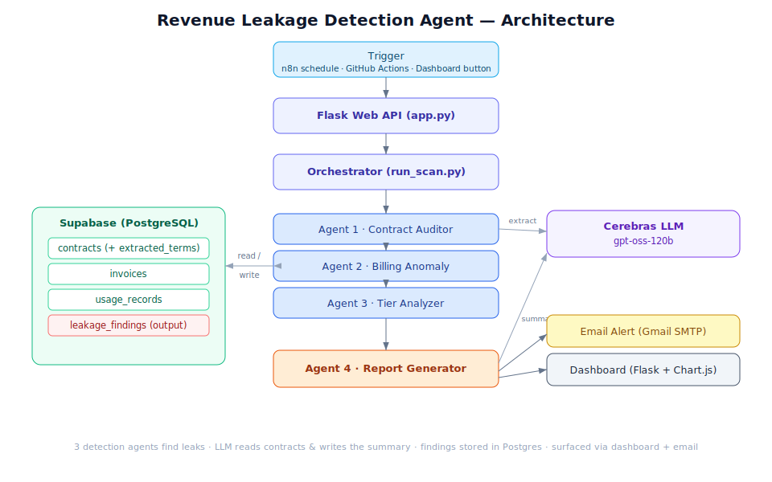

# Revenue Leakage Detection Agent

An autonomous **multi-agent system** that finds invisible revenue loss — uninvoiced
work, contract underbilling, billing anomalies, and subscription tier mismatches —
in real time, with a specific dollar amount attached to every finding.

> Consulting firms charge **$20,000–$80,000** to perform this audit manually.
> This system does it in **under 2 minutes**, on demand, at **zero marginal cost**.

On mock data representing a ~$1M/year SaaS business, it surfaces **$46,760** in
recoverable revenue across 7 findings.



---

## How it works

Four specialized agents, orchestrated by a single scan:

| Agent | Looks for | Technique |
|-------|-----------|-----------|
| **1. Contract Auditor** | Customers billed *less* than their contract | LLM extracts terms from contract text → compares to the typical invoice |
| **2. Billing Anomaly Detector** | Sudden spend drops, missing recurring charges | Pure statistics over invoice history |
| **3. Subscription Tier Analyzer** | Customers using far more than their plan allows | Usage vs. plan limits |
| **4. Report Generator** | Ranks findings, writes the executive summary | LLM turns raw findings into plain English |

**Design principle:** the LLM is used *only* where language understanding is needed
(reading messy contract prose, writing the report). All detection math is
deterministic Python — fast, free, and reproducible.

## Tech stack (100% free tier)

| Tool | Role |
|------|------|
| **Cerebras** (`gpt-oss-120b`) | LLM — contract extraction + report writing |
| **Supabase** (PostgreSQL) | Stores contracts, invoices, usage, findings |
| **Flask** + **Chart.js** | Web API + dashboard |
| **Gmail SMTP** | Email delivery of the report |
| **Render** | Hosting |
| **n8n / GitHub Actions** | Scheduled daily scans |

## Project structure

```
config.py            # loads .env; central settings
database.py          # Supabase client helper
llm_client.py        # OpenAI-compatible client pointed at Cerebras
seed_data.py         # generates + loads mock data
agent_contract.py    # Agent 1 (LLM)
agent_billing.py     # Agent 2 (math)
agent_tier.py        # Agent 3 (math)
run_scan.py          # orchestrator: runs all 3 agents
report_generator.py  # Agent 4 (LLM) -> HTML report
mailer.py            # Gmail SMTP sender
app.py               # Flask web app + API
templates/dashboard.html
db/schema.sql        # database schema
docs/architecture.svg
```

## Run it yourself

```bash
# 1. Install
python -m venv .venv
.venv\Scripts\activate          # Windows  (source .venv/bin/activate on Mac/Linux)
pip install -r requirements.txt

# 2. Configure
cp .env.example .env             # then fill in your keys

# 3. Create tables: paste db/schema.sql into the Supabase SQL editor and run it

# 4. Load mock data
python seed_data.py

# 5. Run a scan
python run_scan.py               # prints findings + total

# 6. Generate + email the report
python report_generator.py --email

# 7. Launch the dashboard
python app.py                    # http://localhost:5000
```

## API

| Endpoint | Method | Purpose |
|----------|--------|---------|
| `/dashboard` | GET | HTML dashboard |
| `/summary` | GET | JSON totals by category |
| `/findings` | GET | JSON of all findings |
| `/report` | GET | Latest HTML report |
| `/run-scan` | POST | Run all 3 detection agents |
| `/generate-report?email=1` | POST | Build the report (and email it) |

Set `DASHBOARD_API_KEY` in `.env` to require an `X-API-Key` header on the
`/run-scan` and `/generate-report` endpoints.

## Sample result

```
SCAN COMPLETE: 7 findings, $46,760.00 total estimated leakage
  Contract Underbilling .......... $18,000
  Billing Anomaly ................  $5,000
  Subscription Tier Mismatch ..... $23,760
```
